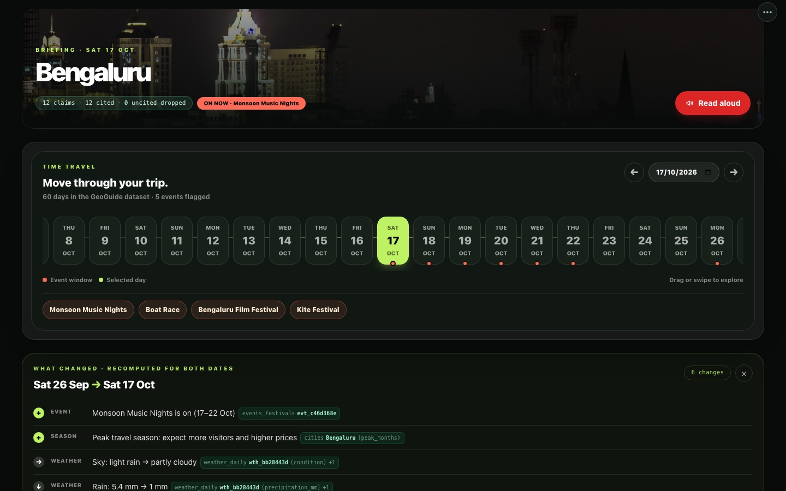
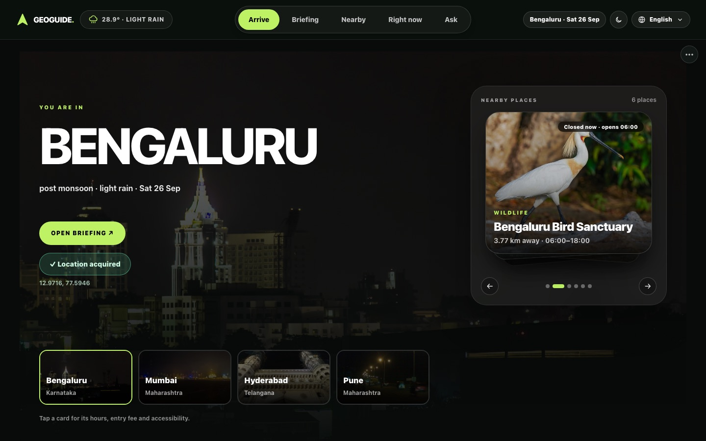
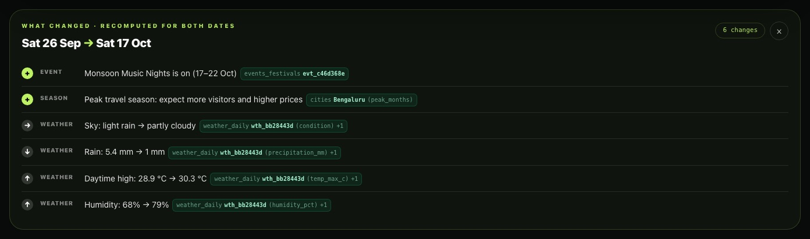
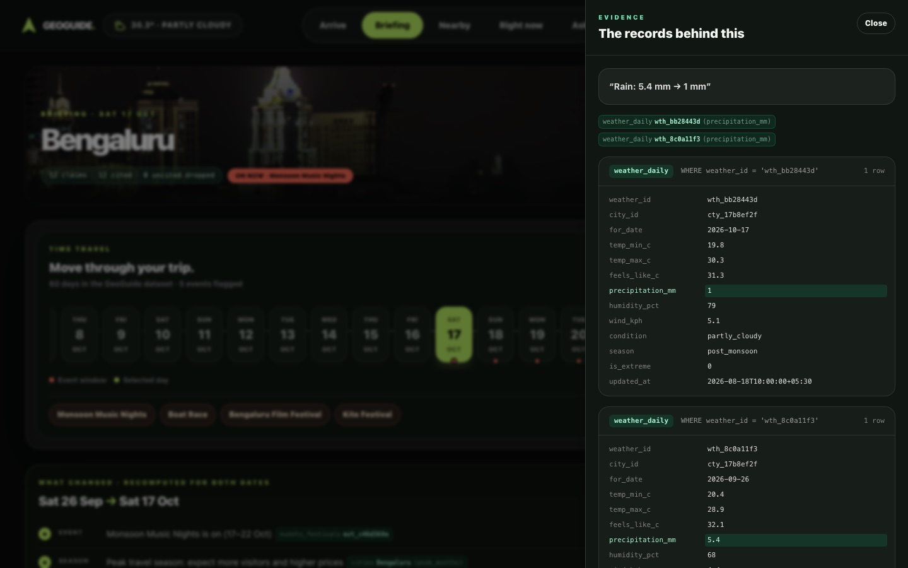
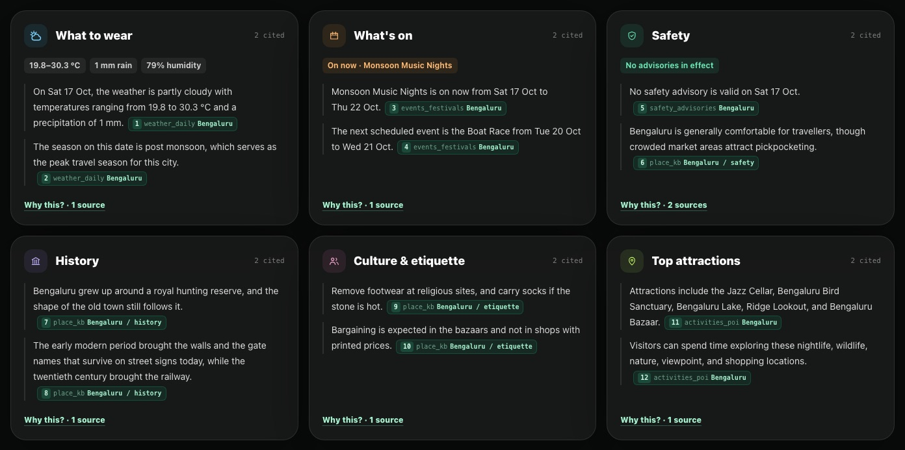
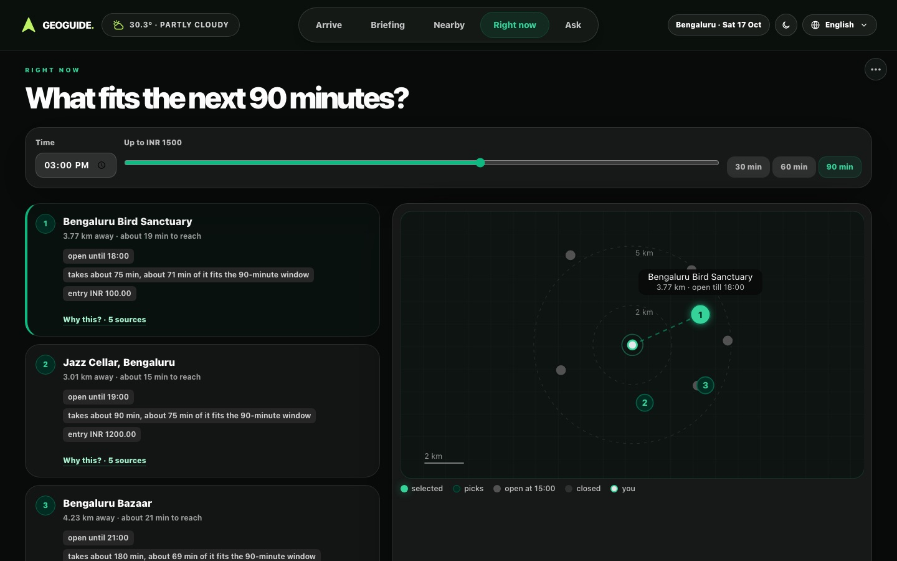
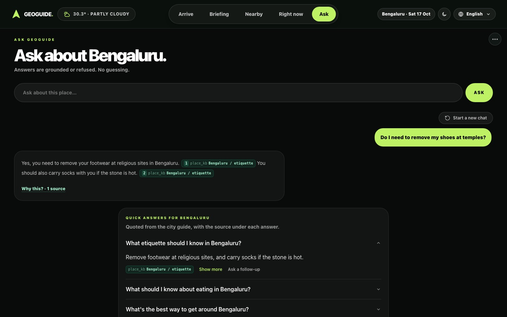
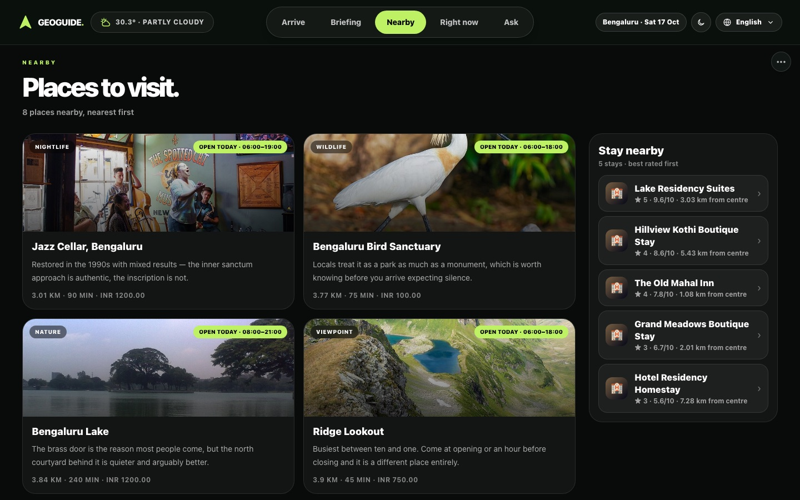
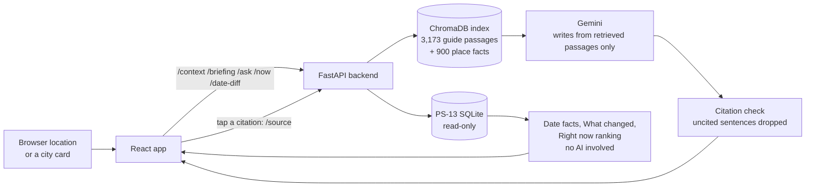

# GeoGuide

**A location-aware travel companion where every AI sentence links to the record it came from.**

GeoGuide works out where you are and which date you're travelling, then briefs you on that place for that date: weather, events, safety, culture, history and top attractions. It shows what's nearby, suggests what fits your next 30 to 90 minutes, and answers questions. Every sentence carries a citation you can tap to see the exact database row or guide passage behind it. When the data can't support an answer, GeoGuide says so instead of guessing.

Built by **Team VVinners** (BMS College of Engineering) for the **KogniVera Hackathon 2026**, problem statement **PS-13: GeoGuide, Location-Aware AI Place Companion**, including the mandatory **Date-Shift Briefing** enhancement.



---

## Contents

- [What it does](#what-it-does)
- [Screens](#screens)
- [How it works](#how-it-works)
- [Keeping the AI grounded](#keeping-the-ai-grounded)
- [Date-Shift Briefing](#date-shift-briefing)
- [Tech stack](#tech-stack)
- [Run it locally](#run-it-locally)
- [Demo walkthrough](#demo-walkthrough)
- [Tests and evaluation](#tests-and-evaluation)
- [Project structure](#project-structure)
- [Limits](#limits)
- [Team](#team)
- [Credits](#credits)

## What it does

| Feature | What you get |
|---|---|
| **Arrive** | Your location matched to the nearest of 60 cities, today's weather, and nearby places as photo cards ("Closed now · opens 06:00") |
| **Briefing** | Six cards (what to wear, what's on, safety, history, culture and etiquette, top attractions), each sentence with a numbered citation |
| **Date-Shift** | Pick any date in the dataset and events, weather, season, advisories and closures are recomputed for it. A "What changed" panel lists the differences |
| **Evidence drawer** | Tap any citation to see the query, the rows it returned, and the cited field highlighted |
| **Nearby** | Places to visit, nearest first, with places to stay in a column beside them and a detail sheet for each |
| **Right now** | What fits the next 30, 60 or 90 minutes within your budget, with a reason (and a citation) for every pick, on a radar map |
| **Ask** | A chat that answers from the city guide with citations, or refuses: live fares, bookings and made-up places are declined |
| **Languages** | English, Hindi and the city's own language (Kannada for Bengaluru), translated with Sarvam AI |
| **Accessibility** | Read aloud (browser speech), an accessible briefing view, light and dark themes, phone layout |
| **Offline** | Every response is kept in the browser. If the connection drops, an offline bar appears and saved briefings and places still load |

## Screens

| | |
|---|---|
|  **Arrive:** location, weather and nearby places |  **What changed:** Sat 26 Sep → Sat 17 Oct, each line cited |
|  **Evidence:** both days' weather rows behind "Rain: 5.4 mm → 1 mm" |  **Briefing cards:** key facts, then cited sentences |
|  **Right now:** picks that fit the window; the selected one glows on the radar |  **Ask:** an answer with numbered citations |
|  **Nearby:** places first, stays beside them | |

## How it works



1. The browser shares its coordinates (with permission, over HTTPS), or you pick a city. The backend finds the nearest city by straight-line distance. Coordinates are not stored.
2. For that city and date, the backend reads the facts straight from the database: the day's weather row, events on the date, advisories valid at noon, and places closed that weekday.
3. For the briefing and chat, it retrieves the most relevant guide passages (city-filtered, by meaning) and asks Gemini to write only from them, citing a passage on every sentence.
4. Sentences without a valid citation are removed. Each remaining one is shown with a chip, and `/source` turns that chip back into the row or passage it names.

## Keeping the AI grounded

GeoGuide uses retrieval-augmented generation (RAG): relevant text is found first, and the model may only write from it. A question passes through these checks, in order:

| Check | What it does | On failure |
|---|---|---|
| **Layer 3: intent** | Rules catch questions the data can never answer: live fares, exchange rates, traffic, bookings and payments, officials' contact details, "ignore your rules" (English and Hindi) | Refuse before any model call |
| **Layer 1: relevance** | The best city-filtered passage must reach a cosine similarity of at least 0.30 | Refuse without calling the model |
| **Generation** | Gemini gets the question and the top 4 numbered passages, and must cite `[n]` on every sentence | — |
| **Layer 2: sentinel** | The model replies with a fixed code word when the passages don't cover the question | Refuse |
| **Citation check** | Every sentence must cite a passage that exists | Drop the sentence; refuse if none remain |

- **Why intent rules run first:** calibration showed some unanswerable questions retrieve well ("How much is a cab to the airport right now?" lands near the transport passage). The threshold was chosen from 56 test questions (37 in-domain, 19 adversarial); see [docs/calibration.md](docs/calibration.md).
- **Grounding-off proof:** the Judges view has a grounding switch. With it off, retrieval returns nothing, so every question is refused. That shows the model never answers from its own knowledge.
- **No model available:** answers quote their source passages word for word, labelled as such, and a question naming a place no source mentions is refused.

## Date-Shift Briefing

Moving the travel date recomputes the briefing's facts from the database for that date. No model is involved, so it's instant, repeatable, and works even if the model is unavailable.

| Fact | How it's decided for the date |
|---|---|
| Events | Active events whose start date ≤ date ≤ end date; if none, "Nothing is scheduled in Bengaluru on Fri 25 Sep", with the next event |
| Weather and tips | The day's `weather_daily` row; tips follow from it (rain ≥ 10 mm → a rain jacket) |
| Season | The row's season, and whether the month is one of the city's peak months |
| Advisories | Those valid at 12:00 noon IST on the date, compared as time-zone-aware date-times |
| Closures | Places whose closed days include that weekday |

After a shift, **What changed** (`GET /date-diff`) computes both dates the same way and lists only the differences, for example "+ Monsoon Music Nights, + peak season, rain 5.4 → 1 mm". Every line cites both rows it compared. An empty date shows its query with **0 rows** rather than inventing an event.

## Tech stack

| Layer | Choice | Why |
|---|---|---|
| Frontend | React 18, Vite 5, Tailwind CSS | Reusable chips, cards and drawers; one date change updates every screen; consistent themes and phone layouts |
| Backend | FastAPI (Python) | Sits next to the Python AI stack; fast, with request validation |
| Data | SQLite (PS-13 dataset), opened read-only | The data can't be changed or added to by the app |
| Retrieval | ChromaDB + `paraphrase-multilingual-MiniLM-L12-v2` | Finds passages by meaning, including Hindi questions; runs locally on a CPU |
| Generation | Google Gemini (Flash, with fallback models); Ollama optional | Fast and follows source-only instructions well |
| Translation | Sarvam AI | Natural Hindi and Kannada |
| Voice | Web Speech API | Read aloud with no extra service |
| Hosting | Vercel (web app); backend local, via a Cloudflare tunnel for demos. A Dockerfile and Render blueprint are included | See [docs/DEPLOY.md](docs/DEPLOY.md) |
| Tests | pytest | 68 tests, see below |

## Run it locally

You need Python 3.11, Node 18+, and a Gemini API key. A Sarvam key is optional (for Hindi and Kannada).

```bash
# 1. Backend environment
python3 -m venv .venv && source .venv/bin/activate
pip install -r backend/requirements.txt

# 2. Keys: set GEMINI_API_KEY and GEMINI_MODEL (and SARVAM_API_KEY if you have one)
cp .env.example .env

# 3. Build the search index from PS-13.db (about a minute)
python -m ai.index --reset

# 4. Optional: generate and cache the demo briefings so they load instantly
python -m ai.prewarm --cities cty_17b8ef2f --dates 2026-09-25 2026-10-17 2026-10-24 --langs en-IN

# 5. Start the API on http://localhost:8000
uvicorn backend.main:app --port 8000
```

In a second terminal:

```bash
cd frontend && npm install && npm run dev    # open http://localhost:5173
```

Check the backend at `http://localhost:8000/health`: expect `"status": "ok"` and the index counts. Keys stay in `.env`, which is git-ignored; never put them in a `VITE_` variable, since those are built into the public web page.

## Demo walkthrough

About five minutes, in Bengaluru:

1. **Arrive:** "You are in Bengaluru", with nearby places.
2. **Briefing:** the header reads "N claims · N cited · 0 uncited dropped". Tap a weather chip: the evidence drawer shows the `weather_daily` row with the cited field highlighted.
3. **Date-Shift:** tap **Monsoon Music Nights** on the date strip (Sat 17 Oct). "What changed" lists the festival, peak season and the weather change. Pick **Sat 24 Oct**: "Monsoon Music Nights is over". On **Fri 25 Sep**, "Nothing is scheduled" carries a 0-rows chip.
4. **Ask:** "Do I need to remove my shoes at temples?" returns a cited answer. "How much is a cab to the airport right now?" is refused. Switch the language to Hindi or Kannada.
5. **Nearby and Right now:** open a hotel's detail sheet and its source chip. Set a time and budget and select a pick on the radar.
6. **Optional:** switch Wi-Fi off. The offline bar appears and the briefing still loads.

A longer script is in [docs/DEMO.md](docs/DEMO.md), and the full project guide is in [docs/GeoGuide-Project-Guide.pdf](docs/GeoGuide-Project-Guide.pdf).

## Tests and evaluation

```bash
python -m pytest tests -q                          # 68 tests
python -m ai.evals.run_eval --set adversarial       # refusal evaluation (needs the index)
```

- `tests/test_grounding.py`: grounding off refuses everything, and uncited output becomes a refusal.
- `tests/test_date_shift.py`, `tests/test_date_facts.py`, `tests/test_date_diff.py`: facts change with the date, empty dates are reported honestly, and every "What changed" citation resolves to a real row.
- `tests/test_source.py`: every citation label resolves to its row by key, and column-style labels don't.
- `tests/test_boundary_rules.py`: the data rules R1–R8 (read-only database, exact decimal money with a currency, time-zone-aware timestamps, active rows only, and more). See [data-model/DATA_MODEL.md](data-model/DATA_MODEL.md).
- Also: city isolation, chat follow-ups and reset, and small talk.

## Project structure

```
frontend/src/
  App.jsx                  the five screens, citation chips, evidence drawer, What changed panel
  api.js                   backend calls and the offline cache
  hooks/useGeoLocation.js  browser location
  components/              photo cards, radar map, date strip, read aloud, accessible briefing
  dates.js                 "Fri 25 Sep" date formatting
backend/
  main.py                  FastAPI app and CORS
  ai_routes.py             every endpoint
  data_queries.py          database queries
  date_facts.py            Date-Shift facts and weather tips (no model)
  date_diff.py             What changed between two dates
  source.py                citation label → database rows
  ranker.py                Right now scoring
ai/
  pipeline.py              question flow: intent → relevance → model → sentinel → citations
  retrieval.py, index.py   ChromaDB retrieval and index build
  refusal.py               intent rules and refusal messages (English, Hindi, Kannada)
  citations.py             citation parsing; drops uncited sentences
  briefing.py, cache.py    briefing generation and its disk cache
  translate.py, session.py Sarvam translation; chat memory for follow-ups
  evals/                   56-question evaluation set
data-model/                PS-13.db and the data rules
docs/                      architecture, calibration, refusal spec, deploy, demo, screenshots, credits
tests/                     pytest suite
```

## Limits

- The dataset covers 1 Sep to 30 Oct 2026; dates outside it move to the nearest covered date.
- No live data (fares, traffic, prices) by design. Those questions are refused.
- Travel times in Right now are estimates (about 12 km/h), not live routing, and the map is a radar drawn from coordinates rather than street tiles.
- Translation depends on the Sarvam API; if it fails, English is shown.
- The grounding switch is a demo control shared by everyone using the same backend.

## Team

**Team VVinners**, BMS College of Engineering

| Member | Area |
|---|---|
| Vamika A Bhat | AI and RAG pipeline, grounding guard |
| Vishnu Mashalkar | Backend, API and orchestration |
| Vachana M H | Frontend and UI/UX |
| Varsha Kusumadhara Kodi | Data, conformance, evidence and Date-Shift |

The canonical team repository is [kognivera-org/kv-hack2026-vvinners](https://github.com/kognivera-org/kv-hack2026-vvinners).

## Credits

The dataset is the PS-13 dataset provided by KogniVera for the hackathon. The tools and libraries used, and the source and license of every photo in the app (all from Wikimedia Commons), are listed in [docs/CREDITS.md](docs/CREDITS.md). Claude (Anthropic) was used as an AI coding assistant during the hackathon window.
